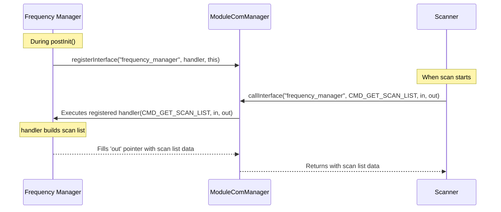

# 2a. Module Internals & Communication (Deepest Dive)

This document expands on the module system, focusing on advanced module types and the critical inter-module communication system that enables complex features like scanning.

## 1. The "Misc" Module Type

While Source, Sink, and Decoder modules have clearly defined roles in the signal path, the `misc_modules/` directory contains modules that add general-purpose functionality. These modules are not part of the DSP chain but integrate with the core application to provide new features.

**Common Patterns for Misc Modules:**
*   **UI Integration:** They often register their own menu panel using `gui::menu.registerEntry`. This gives them a space to render their own UI with ImGui.
*   **Data Persistence:** They typically manage their own configuration files using a separate `ConfigManager` instance.
*   **Core System Interaction:** They can interact with core components like `gui::waterfall` to display information or receive input.
*   **Providing Services:** They can expose their functionality to other modules using the `ModuleComManager`.

### Case Study: The `frequency_manager` Module

The Frequency Manager is a perfect example of a "Misc" module.
1.  **UI:** It calls `gui::menu.registerEntry("Frequency Manager", ...)` to create its panel in the main side menu. All of the UI for managing lists and bookmarks is rendered within this panel.
2.  **Waterfall Overlay:** It uses `gui::waterfall.onFFTRedraw.bindHandler(...)` to get a callback every time the waterfall is redrawn. This allows it to draw frequency bookmarks directly onto the waterfall display. It also uses `gui::waterfall.onInputProcess.bindHandler(...)` to detect clicks on these bookmarks.
3.  **Service Provider:** Most importantly, it acts as a service provider for the `scanner` module. It exposes an interface via `ModuleComManager` that allows the scanner to request a list of frequencies to scan.

## 2. Inter-Module Communication: `ModuleComManager`

The `core::modComManager` is a global object that facilitates communication *between* modules, decoupling them from each other. It implements a service-oriented pattern where one module can register an "interface" (a named callback function) and another module can call it by name.

This prevents modules from needing to know about each other's class structures or having direct dependencies, making the system highly modular.



### 2.1. Providing an Interface

A module that wants to offer services to others must register an interface. This is typically done in its constructor or `postInit` method.

**Example from `frequency_manager/src/main.cpp`:**
```cpp
// In FrequencyManagerModule constructor:
core::modComManager.registerInterface(
    name,                // The instance name (unique identifier)
    "frequency_manager", // The service name that other modules will use
    moduleInterfaceHandler, // A static function pointer to the handler
    this                 // A context pointer passed to the handler
);
```

**Important Notes:**
- The first parameter is the unique instance name, not the module name
- The second parameter is the service identifier other modules will use
- The same service name can't be registered twice
- Always unregister in the destructor to prevent crashes

The `moduleInterfaceHandler` is a static function that receives an integer command code and `void*` pointers for input and output data. It switches on the command code to provide different services.

```cpp
// Command codes (defined in a shared header or documented)
enum FrequencyManagerCommands {
    CMD_GET_SCAN_LIST = 0,
    CMD_GET_BOOKMARK_NAME = 1,
    CMD_APPLY_BOOKMARK_BY_NAME = 2
};

// A complete handler example
static void moduleInterfaceHandler(int code, void* in, void* out, void* ctx) {
    FrequencyManagerModule* _this = (FrequencyManagerModule*)ctx;
    
    switch (code) {
        case CMD_GET_SCAN_LIST: {
            if (out) {
                const std::vector<ScanEntry>& scanList = _this->getScanList();
                *static_cast<const std::vector<ScanEntry>**>(out) = &scanList;
                flog::debug("FrequencyManager: Returned scan list with {} entries", 
                           scanList.size());
            }
            break;
        }
        
        case CMD_GET_BOOKMARK_NAME: {
            if (in && out) {
                double targetFreq = *static_cast<double*>(in);
                std::string* resultName = static_cast<std::string*>(out);
                // Search for bookmark at frequency...
                *resultName = _this->findBookmarkName(targetFreq);
            }
            break;
        }
        
        case CMD_APPLY_BOOKMARK_BY_NAME: {
            if (in) {
                const char* bookmarkName = static_cast<const char*>(in);
                _this->applyBookmark(bookmarkName);
            }
            break;
        }
        
        default:
            flog::warn("Unknown command {} for frequency_manager", code);
            break;
    }
}
```

### 2.2. Consuming an Interface

A module that wants to use a service queries the `ModuleComManager`.

**Conceptual Example for `scanner` module:**
```cpp
// In the Scanner module, when it needs the frequency list:
const std::vector<FrequencyManagerModule::ScanEntry>* scanList = nullptr;

// Call the interface provided by the frequency manager.
// The scanner knows to use the service name "frequency_manager" and command `CMD_GET_SCAN_LIST`.
core::modComManager.callInterface(
    "frequency_manager",      // The service name to call
    CMD_GET_SCAN_LIST,        // The command to execute
    nullptr,                  // No input data for this command
    &scanList                 // Pointer to receive the output
);

if (scanList) {
    // ... iterate through the scanList and scan frequencies ...
}
```

This powerful but simple mechanism allows complex features to be built from independent modules that can be added or removed without breaking the application. For example, if the `frequency_manager` module is not installed, the `callInterface` call will simply do nothing, and the scanner can fall back to a default behavior.

## 3. Advanced Module Development Topics

### 3.1. Module Dependencies and Load Order

While modules should be independent, sometimes soft dependencies exist:

```cpp
void MyModule::postInit() {
    // Check if a dependency is available
    if (core::modComManager.interfaceExists("frequency_manager")) {
        hasFreqManager = true;
        // Can safely use frequency manager features
    }
}
```

### 3.2. Event System Integration

Modules can subscribe to core events:

```cpp
class MyModule : public ModuleManager::Instance {
    EventHandler<VFOManager::VFO*> vfoCreatedHandler;
    
    MyModule(std::string name) {
        // Set up event handler
        vfoCreatedHandler.ctx = this;
        vfoCreatedHandler.handler = onVfoCreated;
        
        // Subscribe to VFO creation events
        sigpath::vfoManager.onVfoCreated.bindHandler(&vfoCreatedHandler);
    }
    
    ~MyModule() {
        sigpath::vfoManager.onVfoCreated.unbindHandler(&vfoCreatedHandler);
    }
    
    static void onVfoCreated(VFOManager::VFO* vfo, void* ctx) {
        MyModule* _this = (MyModule*)ctx;
        flog::info("New VFO created: {}", vfo->name);
    }
};
```

### 3.3. Waterfall Integration

Modules can draw on the waterfall and handle input:

```cpp
// In constructor or postInit
gui::waterfall.onFFTRedraw.bindHandler(&fftRedrawHandler);
gui::waterfall.onInputProcess.bindHandler(&inputHandler);

// Draw handler
static void fftRedraw(ImGui::WaterFall::FFTRedrawArgs args, void* ctx) {
    MyModule* _this = (MyModule*)ctx;
    
    // Draw on the waterfall
    auto window = args.window;  // ImDrawList*
    
    // Convert frequency to pixel position
    double centerFreq = gui::waterfall.getCenterFrequency();
    double bandwidth = gui::waterfall.getBandwidth();
    float pixelPos = args.min.x + ((myFreq - centerFreq + bandwidth/2) / bandwidth) * args.width;
    
    // Draw a line at frequency
    window->AddLine(ImVec2(pixelPos, args.min.y), 
                   ImVec2(pixelPos, args.max.y), 
                   IM_COL32(255, 0, 0, 255));
}
```

### 3.4. Performance Considerations

1. **DSP Thread Rules:**
   - Never allocate memory in DSP callbacks
   - Pre-allocate all buffers in constructor
   - Use atomic operations for parameter updates
   - Avoid system calls (file I/O, network, etc.)

2. **UI Thread Guidelines:**
   - Heavy computations should be offloaded to worker threads
   - Use ImGui::BeginDisabled() when operations are in progress
   - Cache UI state to avoid repeated calculations

3. **Memory Management:**
   - Modules are responsible for all their allocations
   - Clean up in destructor even if init failed
   - Use RAII patterns for resource management

### 3.5. Debugging Tips

1. **Logging:**
   ```cpp
   flog::debug("Module {}: Debug message", name);
   flog::info("Module {}: Info message", name);
   flog::warn("Module {}: Warning", name);
   flog::error("Module {}: Error: {}", name, errorMsg);
   ```

2. **Common Issues:**
   - Module not loading: Check symbol exports and dependencies
   - Crashes on unload: Ensure all handlers are unregistered
   - Audio glitches: Check for blocking in DSP thread
   - UI freezes: Look for blocking operations in menu handlers

3. **Development Workflow:**
   - Build module with debug symbols
   - Use `flog::debug()` liberally during development
   - Test loading/unloading multiple times
   - Verify no memory leaks with tools like Valgrind
