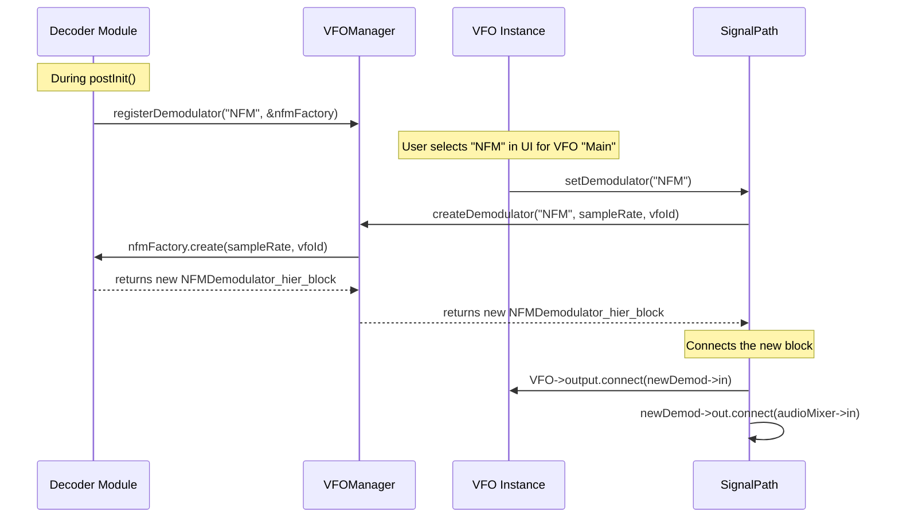

# 3a. DSP Internals & Data Flow (Deepest Dive)

This document provides a granular, implementation-level view of the key DSP blocks and the mechanisms that connect them, building upon the overview in the main Signal Path document.

## 1. Core DSP Building Blocks In-Depth

The DSP chain is built from several critical `dsp::block` components. Understanding their specific roles is key to understanding the signal path's performance and behavior.

### 1.1. Buffer Management Blocks

*   **`dsp::buffer::SampleFrameBuffer<T>` (`inBuf`):** 
    *   **Purpose:** Decouples source timing from DSP processing timing
    *   **Implementation:** Contains a large ring buffer (default 10M samples) and runs its own thread
    *   **Key Methods:**
        - `setSampleRate()`: Updates the internal sample rate tracking
        - `setBufferSize()`: Adjusts the ring buffer size
        - `flush()`: Clears the buffer (useful when retuning)
    *   **Thread Model:** The worker thread continuously moves data from input stream to ring buffer

*   **`dsp::buffer::Reshaper<T>`:**
    *   **Purpose:** Converts continuous stream into fixed-size blocks
    *   **Used By:** FFT processing to create properly-sized FFT frames
    *   **Key Feature:** Can skip samples between blocks to control output rate

### 1.2. Signal Processing Blocks

*   **`dsp::multirate::PowerDecimator<T>` (`decim`):**
    *   **Purpose:** Efficient sample rate reduction with anti-aliasing
    *   **Implementation:** Cascaded half-band filters for powers-of-2 decimation
    *   **Optimization:** Uses VOLK for SIMD acceleration
    *   **Supported Ratios:** 1, 2, 4, 8, 16, 32, 64, 128
    *   **Key Feature:** Automatically selects optimal filter chain based on decimation factor

*   **`dsp::correction::DCBlocker<T>`:**
    *   **Purpose:** Removes DC offset that causes center spike in FFT
    *   **Implementation:** Single-pole high-pass IIR filter
    *   **Formula:** `y[n] = x[n] - x[n-1] + a * y[n-1]`
    *   **Coefficient:** `a = 1.0 - (50.0 / sampleRate)` for ~50 Hz cutoff

### 1.3. Routing and Distribution

*   **`dsp::routing::Splitter<T>` (`split`):**
    *   **Purpose:** Distributes one input to multiple outputs
    *   **Implementation:** 
        ```cpp
        int run() {
            int count = in->read();
            if (count < 0) return -1;
            
            // Write same data to all outputs
            for (auto& out : outputs) {
                memcpy(out->writeBuf, in->readBuf, count * sizeof(T));
                out->swap(count);
            }
            
            in->flush();
            return count;
        }
        ```
    *   **Zero-Copy Note:** Despite the code above, some implementations use pointer sharing for true zero-copy

### 1.4. Filtering

*   **`dsp::filter::DecimatingFIR<T>`:**
    *   **Purpose:** Combined filtering and decimation in VFOs
    *   **Implementation:** FIR filter with integrated decimation
    *   **Optimization:** Only computes output samples (not decimated samples)
    *   **Coefficient Generation:** Uses window method or remez exchange
    *   **Key Feature:** Dynamically reconfigurable for different bandwidths

## 2. `RxVFO` Internals: A Closer Look

The `dsp::channel::RxVFO` is a `hier_block` that encapsulates the logic for tuning and filtering a single channel.

```mermaid
graph TD
    subgraph RxVFO hier_block
        A[Input IQ Stream] --> B{dsp::math::Multiply};
        C[dsp::math::Phasor (NCO)] --> B;
        B --> D[dsp::taps::tap - Filter Taps];
        D --> E[dsp::filter::DecimatingFIR];
        E --> F[dsp::buffer::SampleFrameBuffer];
        F --> G[Output IQ Stream];
    end
```

### 2.1. Implementation Details

1.  **The NCO (`dsp::math::Phasor`):** 
    *   **Implementation:** Phase accumulator with sine/cosine lookup or calculation
    *   **Frequency Control:** Uses `std::atomic<double>` for thread-safe updates
    *   **Phase Continuity:** Maintains phase across frequency changes to avoid clicks
    *   **Formula:** `phase += 2π * frequency / sampleRate`

2.  **The Mixer (`dsp::math::Multiply<dsp::complex_t>`):**
    *   **Operation:** Complex multiplication for frequency translation
    *   **Formula:** `out = in * conj(nco)` for down-conversion
    *   **Optimization:** May use VOLK volk_32fc_x2_multiply_32fc

3.  **Filter Configuration (`dsp::taps::tap<T>`):**
    *   **Purpose:** Generates and manages filter coefficients
    *   **Methods:** Window-based design or Parks-McClellan (remez)
    *   **Dynamic Updates:** Can recalculate taps when bandwidth changes

4.  **Output Buffering:**
    *   Some VFO implementations add another `SampleFrameBuffer` at the output
    *   Provides additional decoupling between VFO and demodulator timing

### 2.2. Threading and Synchronization

The VFO uses the hier_block pattern, so its components run in separate threads:

*   **Mixer Thread:** Runs the multiply block's `run()` loop
*   **Filter Thread:** Runs the FIR filter's `run()` loop  
*   **UI Updates:** Come from the main thread via atomic variables

Key synchronization points:
*   Frequency changes via `setOffset()` - atomic write
*   Bandwidth changes via `setBandwidth()` - mutex-protected filter update
*   Start/stop operations - coordinated by hier_block base class

## 3. Dynamic Demodulator Integration

The process of connecting a specific demodulator (e.g., NFM, WFM, AM) to a VFO is a prime example of the modular architecture. The `VFOManager` acts as a broker, and it does **not** have any direct knowledge of the demodulators themselves.



1.  **Registration:** When a decoder module (like the built-in `radio` module) is loaded, its `postInit()` function is called. In this function, it registers one or more "demodulator factories" with the global `sigpath::vfoManager`. It provides a string name (e.g., "NFM") and a pointer to a factory object.
2.  **Instantiation:** When the user selects a demodulation mode from a VFO's dropdown menu in the UI, the `SignalPath` is notified. It calls `vfoManager.createDemodulator()`, passing the selected string name.
3.  **Factory Call:** The `VFOManager` looks up the name in its map of registered factories and calls the `create()` method on the corresponding factory object.
4.  **Connection:** The factory's `create()` method allocates (`new`) and returns a complete, self-contained `dsp::hier_block` that performs that specific type of demodulation. The `SignalPath` then connects the VFO's IQ output stream to the new demodulator block's input, and connects the demodulator's audio output stream to the main audio mixer.

This factory pattern completely decouples the core signal path from the implementation details of any specific demodulator.

## 4. Final Audio Path & Mixing

The `SignalPath` class is responsible for the final stage of processing: converting the audio from individual VFOs into a single stream for the output device.

### 4.1. Audio Stream Management

*   **Audio Streams:** Each VFO's demodulator outputs `dsp::stream<dsp::stereo_t>` (stereo float samples)
*   **Sample Format:** 32-bit floating point, -1.0 to +1.0 range
*   **Sample Rates:** Typically 48 kHz, but configurable per demodulator

### 4.2. The Audio Mixer

The mixer implementation is more complex than simple addition:

```cpp
// Simplified mixer logic
int run() {
    // Read from all inputs
    for (int i = 0; i < inputCount; i++) {
        counts[i] = inputs[i]->read();
    }
    
    // Mix samples
    for (int s = 0; s < outCount; s++) {
        float left = 0, right = 0;
        
        // Sum all active inputs
        for (int i = 0; i < inputCount; i++) {
            if (counts[i] > s) {
                left += inputs[i]->readBuf[s].l * volumes[i];
                right += inputs[i]->readBuf[s].r * volumes[i];
            }
        }
        
        // Apply master volume and limiting
        left *= masterVolume;
        right *= masterVolume;
        
        // Soft clipping to prevent distortion
        out->writeBuf[s].l = std::tanh(left);
        out->writeBuf[s].r = std::tanh(right);
    }
    
    // Send mixed audio
    out->swap(outCount);
}
```

### 4.3. Sink Connection

The mixed audio stream connects to the active sink:

1. **Stream Registration:** Sinks register streams with `SinkManager`
2. **Dynamic Routing:** User can switch sinks without interrupting DSP
3. **Sample Rate Negotiation:** Sinks can request specific sample rates
4. **Buffer Management:** Each sink manages its own buffering strategy

## 5. Performance Optimization Techniques

### 5.1. SIMD Optimization

SDR++CE uses the VOLK library for SIMD operations:

*   **Complex Multiplication:** `volk_32fc_x2_multiply_32fc`
*   **Magnitude Calculation:** `volk_32fc_magnitude_32f`
*   **Type Conversion:** `volk_32f_s32f_convert_16i`

### 5.2. Memory Management

*   **Buffer Pools:** Pre-allocated buffers reused across processing
*   **Alignment:** Buffers aligned to 16/32 bytes for SIMD efficiency
*   **Cache Awareness:** Processing blocks sized to fit in L1/L2 cache

### 5.3. Threading Strategy

*   **Thread Affinity:** DSP threads can be pinned to specific cores
*   **Priority Inheritance:** Avoids priority inversion in audio path
*   **Lock-Free Communication:** Where possible (atomic variables, SPSC queues)

### 5.4. Common Performance Pitfalls

1. **Buffer Size Mismatch:** Too small causes overhead, too large causes latency
2. **Excessive Decimation Stages:** Each stage adds latency
3. **UI Thread Blocking:** Never do heavy processing in menu handlers
4. **Memory Allocation:** Any allocation in DSP path causes glitches

## 6. Debugging DSP Issues

### 6.1. Common Problems and Solutions

*   **Audio Glitches:** Check for memory allocations or blocking calls
*   **High CPU Usage:** Profile decimation ratios and FFT sizes
*   **Frequency Offset:** Verify NCO phase accumulator precision
*   **Distorted Audio:** Check for overflow in mixing or demodulation

### 6.2. Debug Techniques

*   **Signal Injection:** Use `dsp::gen::` blocks for test signals
*   **Tap Points:** Insert `dsp::sink::Handler` blocks to capture data
*   **Performance Counters:** Measure samples/second at key points
*   **Thread Profiling:** Use platform tools to check thread behavior
